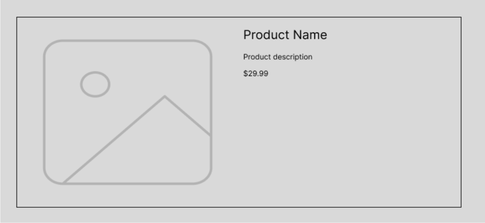

# Prompt

Imagine you're building an online store and need to create product cards that showcase product information in a visually appealing way. These cards need to look good on any device, from desktops to mobile phones. We'll use flexbox to achieve a responsive layout with clear separation between image and details

## Step 1: Plan the Layout

**Define Content Structure:** Our basic HTML structure will include elements like an `<h3>` for the product name, a `<p>` for a brief description, an `` for the product image, and potentially another `<p>` for the price. We'll wrap these elements in a container element with a class name for easier styling.

**Create an HTML file** (`index.html`) and add the following structure for your product card

*HTML Code Snippet: *

```
<!DOCTYPE html>

<html lang="en">

    <head>

    <meta charset="UTF-8">
    <title>Product Card</title>
    <link rel="stylesheet" href="style.css">

    </head>

    <body>

        <div class="product-card">

            
            
            <div class="product-card-details">

                <h3>Product Name</h3>
                <p>Lorem ipsum dolor sit amet consectetur adipisicing elit. Qui odio ut rerum sapiente nihil, culpa quos fuga.</p>
                <p class="price">$29.99</p>

            </div>

        </div>  
    
    </body>

</html>
```
**Sketch or Wireframe:** Here, a simple two-column layout would work well. 
* One column will hold the product image, and the other will hold the product details (name, description, price).
* This isn’t necessary here, but you can take this extra step if you’d like. When working on a larger project, always wireframe first. 



## Step 2: Choose a Layout Method

**Evaluate Options:** Flexbox is an ideal choice for this two-column layout because it offers flexibility in arranging elements along a single axis (horizontal in this case).

**Select the Best Fit:** We'll use flexbox to structure the product card with the image and details side-by-side.

## Step 3: Define Layout Styles

**Create a new CSS file** (name it `style.css`) and open it in your code editor.

**Target Container Elements:** We'll target the element containing the entire product card using a class selector

**Apply Layout Properties:**
* `display: flex` activates the flexbox layout for the `.product-card` element.

* `flex-wrap: wrap` ensures elements can wrap onto a new line if there's not enough space on smaller screens (important for responsiveness).

* `border: 1px` solid #ddd adds a thin border around the card.

* `padding: 1em` adds some space around the content inside the card.

* `margin: 1em` adds some space around the outside of the card.

*CSS Code Snippet:*

```
.product-card {

    display: flex; /* Activate flexbox layout */

    flex-wrap: wrap; /* Allow elements to wrap on smaller screens */

    border: 1px solid #ddd; /* Add a thin border */

    padding: 1em; /* Add some space around the content */

    margin: 1em; /* Add some margin between cards */

  }
```

## Step 4: Style Individual Elements

**Style the Product Image:** Let's target the image element:
* `flex: 1 1 auto` allows the image to shrink and grow as needed based on the available space.

* `padding: 0.5em` adds some padding around the image.

* `max-width: 40%` ensures the image does not exceed 40% of the container's width.

* `object-fit: cover` ensures the image covers the given space proportionally.

*CSS Code Snippet:*

```
.product-card {
    display: flex; /* Activate flexbox layout */
    flex-wrap: wrap; /* Allow elements to wrap on smaller screens */
    border: 1px solid #ddd; /* Add a thin border */
    padding: 1em; /* Add some space around the content */
    margin: 1em; /* Add some margin between cards */
  }
```

***Style the Product Details:*** We'll target the container element for the details:
* `flex: 1 1 auto` allows the product details section to fill the remaining space in the container and grow if needed.

* `padding: 0.5em` adds some padding for the content.

*CSS Code Snippet:*

```
.product-card img {
    flex: 1 1 auto; /* Allow the image to shrink and grow as needed */
    padding: 0.5em; /* Add some padding around the image */
    width: 40%; /* Sets the image to 40% of the container 
}
```
**Style Text Elements (Optional):** You can add styles for the title, description, and price using selectors like `<h3>` and `<p>`.

## Step 5: Test and Refine

1. Save your CSS code.
2. Open your HTML file in a web browser.
    * You should see a product card with an image on the left and product details on the right. If not, review the sections above.
    * If you go into the developer tools and adjust the screen size, you can already see this is responsive without having to write any media queries. The flexbox layout makes the elements adjust naturally to the available space, helping with responsive design.
3. Note [I used this Amazon listing for a Razer Death Adder mouse as my product](https://www.amazon.com/Razer-DeathAdder-Essential-Gaming-Mouse/dp/B094PS5RZQ/ref=asc_df_B094PS5RZQ?mcid=3c493e885b273a71b234666b758f719f&hvocijid=9121379142059027335-B094PS5RZQ-&hvexpln=73&tag=hyprod-20&linkCode=df0&hvadid=721245378154&hvpos=&hvnetw=g&hvrand=9121379142059027335&hvpone=&hvptwo=&hvqmt=&hvdev=c&hvdvcmdl=&hvlocint=&hvlocphy=9028710&hvtargid=pla-2281435178778&th=1)